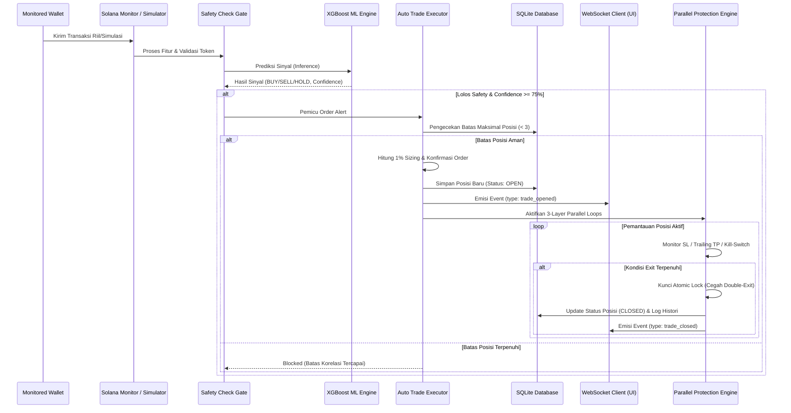

# Dokumentasi Implementasi Fitur F-08 s/d F-11
**Sumber Makmur Trading System Backend & UI Integration**

Dokumentasi ini menjelaskan arsitektur, berkas program, konfigurasi, dan alur kerja dari fitur eksekusi otomatis, proteksi posisi, retraining model harian, dan bootstrap model awal yang telah diimplementasikan.

---

## 📂 Ringkasan Berkas yang Dibuat & Dimodifikasi

### 1. Berkas Baru (New Files)
*   **[auto_trade_executor.py](file:///c:/laragon/www/sumber_makmur_projek/backend/app/use_cases/auto_trade_executor.py)**: Berisi logic eksekusi order otomatis (F-08), perhitungan sizing 1% risk, pengecekan korelasi posisi, simulasi penandatanganan order, dan penyimpanan posisi terbuka ke database.
*   **[retrain_scheduler.py](file:///c:/laragon/www/sumber_makmur_projek/backend/app/use_cases/retrain_scheduler.py)**: Mengatur jadwal retraining otomatis (F-10) setiap jam 02:00 UTC, verifikasi batas jumlah data (dataset 30 hari bergulir), proses training XGBoost di background thread, serta mekanisme Rollback Guard.
*   **[frontend_run_guide.md](file:///c:/laragon/www/sumber_makmur_projek/frontend_run_guide.md)**: Panduan menjalankan UI Frontend dan Simulator secara bersamaan.

### 2. Berkas yang Dimodifikasi (Modified Files)
*   **[inference.py](file:///c:/laragon/www/sumber_makmur_projek/backend/app/ml_pipeline/inference.py)**: Menambahkan dependency injection repositori histori ke XGBoost, dan logic penulisan 120 transaksi bootstrap (`is_bootstrap=True`) ke database saat startup (F-11).
*   **[executor.py](file:///c:/laragon/www/sumber_makmur_projek/backend/app/execution/executor.py)**: Dirombak untuk mengimplementasikan `ParallelExecutionEngine` (F-09) yang memantau Stop Loss, Trailing Take Profit, dan Kill-Switch secara paralel menggunakan asyncio lock.
*   **[main.py](file:///c:/laragon/www/sumber_makmur_projek/backend/app/main.py)**: Mengintegrasikan inisialisasi AutoTradeExecutor, DashboardQueryService, serta perulangan retraining scheduler di dalam lifecycle startup/shutdown FastAPI.
*   **[routes.py](file:///c:/laragon/www/sumber_makmur_projek/backend/app/api/routes.py)**: Mendaftarkan router dashboard dan memperbarui endpoint `/retrain` untuk memicu retraining manual secara interaktif.
*   **[dashboard_query.py](file:///c:/laragon/www/sumber_makmur_projek/backend/app/use_cases/dashboard_query.py)** & **[dashboard_routes.py](file:///c:/laragon/www/sumber_makmur_projek/backend/app/api/dashboard_routes.py)**: Menghubungkan pembacaan posisi aktif langsung dari database SQLite.
*   **[useWebSocket.ts](file:///c:/laragon/www/sumber_makmur_projek/frontend/src/hooks/useWebSocket.ts)**: Memperbaiki pemetaan tipe data event WebSocket tiruan (`signal_new`, `trade_opened`, `trade_closed`, dan `initial_state`) agar tersinkronisasi langsung ke tampilan UI.
*   **[simulate.py](file:///c:/laragon/www/sumber_makmur_projek/backend/simulate.py)**: Ditata ulang dengan format log warna ANSI, emoji representatif komponen, dan penanganan encoding UTF-8 agar tampilan terminal simulator lebih interaktif dan profesional.

---

## ⚙️ Detail Fitur & Logika Bisnis

### F-08: Auto Trade Execution
1.  **Syarat Pemicu**: `AlertSignal` masuk dari ML Pipeline (Confidence >= 75% & Lolos Uji Safety).
2.  **Correlation Cap**: Memeriksa tabel `open_positions` di SQLite. Jika jumlah posisi terbuka `>= 3` (risiko korelasi koin), order baru akan **diblokir** (Blocked).
3.  **Position Sizing**: Dihitung dari 1% risk:
    $$\text{Position Size (USD)} = \frac{\text{Equity } (\$10.000) \times \text{Risk } (1\%)}{\text{Jarak Stop Loss } (10\%)} = \$1.000$$
4.  **Eksekusi**: Melakukan mock call API pump.fun untuk mendapatkan quote, menandatangani transaksi menggunakan private key terenkripsi lokal (AES-256), dan melakukan polling konfirmasi selama maks 10 detik.
5.  **Penyimpanan**: Menulis posisi baru ke database SQLite dengan status `OPEN`.
6.  **Dashboard Alert**: Memancarkan event `trade_opened` ke UI via WebSocket.

### F-09: Three-Layer Position Protection (Proteksi 3 Lapis)
Tiga coroutine dipicu berjalan secara konkuren untuk memantau posisi aktif:
1.  **Lapis 1 (Stop Loss)**: Order jual otomatis terpicu jika harga koin turun $\le$ harga entry dikurangi jarak SL (SL tetap di -1R).
2.  **Lapis 2 (Staged Trailing TP)**:
    *   Jika keuntungan puncak $< 2\text{R}$: Trailing stop belum aktif.
    *   Jika keuntungan puncak $2\text{R}$ s/d $5\text{R}$: SL digeser secara dinamis mengekor 25% dari titik puncak harga.
    *   Jika keuntungan puncak $5\text{R}$ s/d $10\text{R}$: SL digeser mengekor 15% dari titik puncak harga.
    *   Jika keuntungan puncak $> 10\text{R}$: SL digeser mengekor 10% dari titik puncak harga.
3.  **Lapis 3 (On-chain Kill-Switch)**: Mendeteksi anomali on-chain darurat seperti likuiditas ditarik (LP pulled), dev dump, atau slippage spike besar untuk memicu exit darurat.
4.  **Atomic Exit Guarantee**: Menggunakan `asyncio.Lock()` untuk memastikan hanya ada satu layer proteksi yang sukses mengeksekusi order jual koin pertama kali guna menghindari transaksi jual ganda.

### F-10: 24h Retrain & Rollback Scheduler
1.  **Jadwal**: Berjalan otomatis setiap jam 02:00 UTC atau langsung saat startup jika proses belum pernah dijalankan dalam 24 jam terakhir.
2.  **Kriteria Dataset**: Menarik data transaksi tertutup dari 30 hari terakhir (tidak termasuk exit darurat / kill-switch). Minimal harus terkumpul 100 closed trades, ATAU 50 closed trades jika minimal 15 di antaranya memiliki performa positif berlabel `BUY_BENAR`.
3.  **Labeling**:
    *   `BUY_BENAR` (1): Jika transaksi menghasilkan keuntungan $\ge 3\text{R}$.
    *   `SALAH` (2): Jika transaksi menghasilkan kerugian $\le -1\text{R}$.
    *   `HOLD` (0): Di luar kedua kondisi tersebut.
4.  **Rollback Guard**: Sebelum mengaktifkan model baru, akurasi validasi XGBoost diuji. Jika akurasi validasi model baru turun $> 5\%$ dibanding model lama, ATAU nilai Expectancy R bernilai negatif ($< 0$), model baru ditolak (Rollback), model lama tetap aktif, dan sistem mengirimkan peringatan ke UI.
5.  **Expectancy R Formula**:
    $$\text{Expectancy R} = (\text{Win Rate} \times \text{Average R Win}) - ((1 - \text{Win Rate}) \times 1\text{R})$$
6.  **Hot Reload**: Melakukan reset cache model pada `XGBoostInferenceEngine` sehingga model baru dimuat secara instan tanpa perlu mematikan aplikasi backend.

### F-11: Model v0 Bootstrap
*   Mengatasi masalah *cold start* (tidak ada transaksi di awal aplikasi).
*   Menghasilkan data historis 120 transaksi whale secara sintetis dan menyimpannya di SQLite dengan status `CLOSED` serta flag `is_bootstrap=True` agar penjadwal F-10 dapat langsung berjalan tanpa menunggu data riil terkumpul.

---

## 🔄 Visualisasi Alur Data (Data Flow Diagram)

